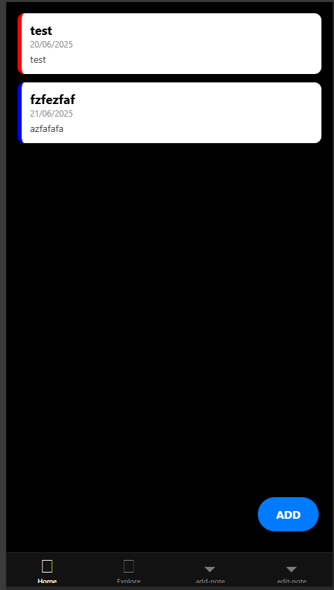
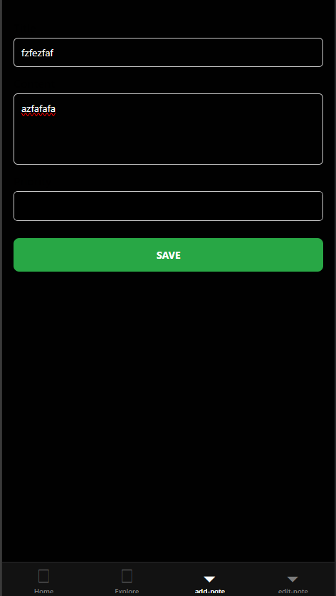
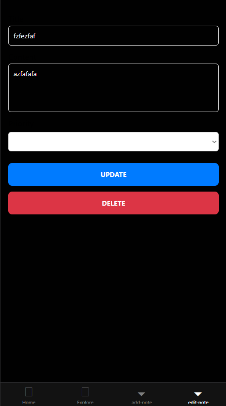

# 📱 myNotes

**myNotes** is a mobile-first note-taking application built with **React Native** and **Expo Router**.  
It allows users to create, edit, and delete personal notes stored **locally** on the device (no cloud), respecting **RGPD** compliance.

---

## 🚀 Features

- 📌 Create, view, edit, and delete notes  
- 🗂️ Note priority levels (Important, Normal, Memo)  
- 💾 Local data persistence with `AsyncStorage`  
- 📱 Responsive UI (mobile/tablet, light)  
- 🔁 Expo Router-based navigation  
- 🌐 Works with Expo Go or Web

---

## 📦 Installation

### 1. Clone the repository

```bash
git clone https://github.com/Matthieu-Wivers/Project4---MyNotes.git
cd Project4---MyNotes
```

### 2. Install dependencies

```bash
npm install
```

### 3. Create entry point if missing

Make sure a `index.js` file exists at the root with:

```js
import 'expo-router/entry';
```

### 4. Start the development server

```bash
npx expo start
```

To preview on web:

```bash
npx expo start --web
```

> 💡 You can scan the QR code with the **Expo Go** app on your mobile.

---

## 🧱 Project Structure

```
myNotes/
├── app/
│   ├── index.tsx         # Notes dashboard
│   ├── add-note.tsx      # Add a note
│   ├── edit-note.tsx     # Edit/delete a note
│   └── (tabs)/_layout.tsx # Tab navigation layout
├── constants/
│   └── priority.ts       # Priority colors and labels
├── index.js              # Expo entry point (expo-router)
├── package.json
└── app.json
```

---

## ✅ Requirements

- Node.js ≥ 18  
- `npx` or `expo-cli`  
- A mobile device with Expo Go or a simulator

---

## 🧠 Tech Stack

- [React Native](https://reactnative.dev/)  
- [Expo](https://expo.dev/)  
- [Expo Router](https://expo.github.io/router/)  
- [AsyncStorage](https://react-native-async-storage.github.io/async-storage/)

---

## 📸 Screenshots





---

## © 2025 Matthieu GANET

Project created as part of a school assignment at L'École Multimédia.
